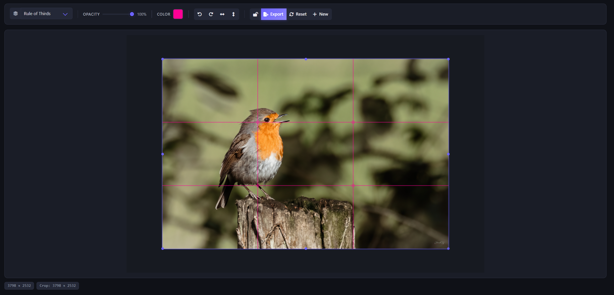

<p align="center">
  
  
  
  <a href="https://github.com/ClementLG/Rectify/blob/main/LICENSE">
    
  </a>
</p>

<p align="center">
  <a href="https://www.buymeacoffee.com/clementlg">
    
  </a>
</p>


# Rectify

Rectify is a minimalist yet powerful image cropping web application. Designed with photography and art composition in mind, it provides advanced overlay guides based on professional mathematical and artistic rules to ensure optimal photo framing.



## Features

- **Advanced Overlays**: Support for classic proportion guides such as the Rule of Thirds, Golden Spiral, Golden Triangles, Dynamic Symmetry, and more.
- **Privacy First**: Secure upload handling with completely isolated sessions and automated lifecycle management.
- **Robust Image Processing**: Powered by Pillow for accurate, secure manipulations, with strict dimension and format constraints.
- **Responsive UI**: Intuitive interface powered by Cropper.js and styled with Bulma, ensuring a seamless experience across all screen sizes.
- **Self-Cleaning Storage**: Built-in background service prevents storage saturation through regular sweeps based on file age and size caps.

## Quick Install

### Prerequisites

- **Docker** and **Docker Compose**
- **Python 3.10+** (For local virtual environment deployment)

### Method 1: Docker (Recommended)

1. Clone the repository:
   ```bash
   git clone https://github.com/yourusername/rectify.git
   cd rectify
   ```

2. Build and start the container:
   ```bash
   docker-compose up -d --build
   ```
   > **Note**: For local development, uncomment the port mapping `8000:8000` in the `docker-compose.yml` to access the application at `http://localhost:8000`. In production, the app is expected to run behind a reverse proxy (e.g., Nginx, Traefik).

### Method 2: Local Python Environment

1. Clone the repository and navigate to the directory:
   ```bash
   git clone https://github.com/yourusername/rectify.git
   cd rectify
   ```

2. Create and activate a virtual environment:
   
   **On Windows:**
   ```powershell
   python -m venv venv
   .\venv\Scripts\activate
   ```

   **On macOS / Linux:**
   ```bash
   python3 -m venv venv
   source venv/bin/activate
   ```

3. Install the required dependencies:
   ```bash
   pip install -r requirements.txt
   ```

4. Run the application:
   ```bash
   python app.py
   ```
   *The application will now be accessible locally.*

## Configuration & Default Values

Rectify is highly configurable. You can override these variables via environment variables or adjust the defaults in `config.py`.

| Variable | Default Value | Description |
| :--- | :--- | :--- |
| `APP_ENV` | `production` | Environment mode (`production` or `development`). |
| `MAX_CONTENT_LENGTH` | `10 * 1024 * 1024` (10 MB) | Maximum footprint allowed per file upload. |
| `MAX_IMAGE_PIXELS` | `50_000_000` (50 MP) | Image pixel limit preventing decompression bombs. |
| `ALLOWED_EXTENSIONS` | `png, jpg, jpeg, webp` | Supported file extensions. |
| `DEFAULT_OVERLAY` | `rule-of-thirds` | Initial grid overlay loaded dynamically. |
| `RATELIMIT_DEFAULT` | `200 per day;50 per hour` | Base rate limit protecting the API endpoint. |
| `UPLOAD_FOLDER` | `uploads` | Base local system directory for storing active sessions. |
| `MAX_STORAGE_MB` | `500` (MB) | Cap limits for combined storage in the uploads directory. |
| `STORAGE_WARN_PERCENT` | `80` (%) | Threshold limit before forced garbage collection begins. |
| `CLEANUP_INTERVAL` | `1800` (30 mins) | Interval tracking for routine background cleanups. |
| `RETENTION_SECONDS` | `3600` (1 hour) | Retention constraint per session (deleted afterward). |

## License

This project is open-source and distributed under the terms defined in the `LICENSE` file.